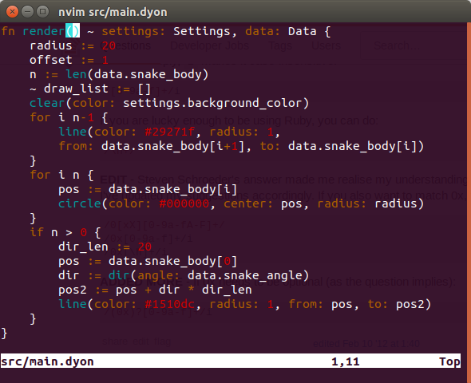

# vim-dyon



Basic syntax highlighting and indentation for [dyon](https://github.com/PistonDevelopers/dyon) programming language.

### How to install

Install [Vim-Pathogen](https://github.com/tpope/vim-pathogen).

Open up the Terminal window and type the following:

```
cd ~/.vim/bundle
git clone https://github.com/thyrgle/vim-dyon
```

Next time you use open up the Terminal window and use Vim on `.dyon` files, the syntax should be on.
